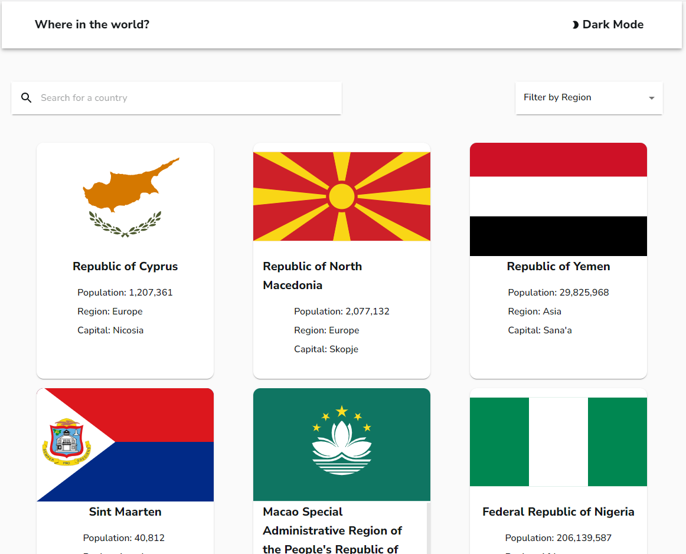

# REST Countries API with Color Theme Switcher - Next.js

This is a solution to the [REST Countries API with color theme switcher challenge on Frontend Mentor](https://www.frontendmentor.io/challenges/rest-countries-api-with-color-theme-switcher-5cacc469fec04111f7b848ca).

## Table of contents

-   [Overview](#overview)
    -   [The challenge](#the-challenge)
    -   [Screenshot](#screenshot)
    -   [Links](#links)
-   [My process](#my-process)
    -   [Built with](#built-with)
    -   [What I learned](#what-i-learned)
    -   [Continued development](#continued-development)
    -   [Useful resources](#useful-resources)
-   [Author](#author)
-   [Acknowledgments](#acknowledgments)

## Overview

### The challenge

Progress based on the Frontend Mentor Challenge:

-[x] See all countries from the API on the homepage 
-[x] Search for a country using an `input` field 
-[x] Filter countries by region 
-[x] Click on a country to see more detailed information on a separate page 
-[x] Click through to the border countries on the detail page 
-[x] Toggle the color scheme between light and dark mode _(optional)_

### Screenshot




### Links

-   Solution URL: [https://github.com/jpal91/rest-country-nextjs](https://github.com/jpal91/rest-country-nextjs)
-   Live Site URL: [https://rest-country-nextjs.vercel.app/](https://rest-country-nextjs.vercel.app/)

## My process

### Built with

- [Next.js](https://nextjs.org/) - React framework
- [Material UI](https://mui.com/material-ui/) - For CSS Components, Grid, Mobile, Theme, etc.

### What I learned

Second Next.js app and this one had a lot more use for what Next.js is good at, mainly Static Generation. I used this quite extensively on the main page (pages/index.js) as well as the filter page (pages/filter/[regionid].js). This made for very fast static loading on both the initial render of the main page as well as all of the filter pages. 

When I was creating the main page, I had difficulty with the fact that ALL countries were loading simultaneously. This decreased the Lighthouse scores significantly as 250+ DOM objects were being loaded at once. I decided to leverage a new component/package - InfiniteScroll on the CountryCardContainer component: 

```js
        <InfiniteScroll
            dataLength={dataArray.length}
            next={fetchMoreData}
            hasMore={true}
            loader={<h4>Loading...</h4>}
            style={{ display: 'flex', flexDirection: 'row', flexWrap: 'wrap', justifyContent: 'space-evenly' }}
        >
```

Infinite scroll allowed me to only render the first 30 (arbitrary number) countries on the page to limit the DOM size. Then as the user scrolls, it will generate the next 30 (and so on) as they scroll down. Lighthouse scores increased dramatically just with this one change

I still had some issues with the images that are negatively impacting my score unfortunately. Not really sure what the fix is. 

### Continued development

I was having difficulty nailing down proper updating of loading states throughout the app for a while. It's still not perfect, but it does work. I need to get more experience with both Next.js useRouter() as well as the Link component to understand how to programatically update the states more efficiently after switching pages. 

I had a HUGE learning curve on trying to get MUI ThemeProvider to do what I wanted with the components based on the light/dark mode. I was able to figure out quite a bit, but some of these sub components that MUI provides are still a bit of a mystery to me. I learn something new everytime I make a project with MUI, though, so improvement is always on the horizon!

Along the same lines as MUI, there's still a little bit of "jumpyness" that happens when going through each page. Was having some difficulty there. It's not very noticeable, but it's definitely present. Need to work on separating the styles out so they don't impact eachother, especially on an action like opening a menu or going back and forth between pages. 

### Useful resources

-   [Infinite Scroll](https://www.npmjs.com/package/react-infinite-scroll-component) - Helped me out a ton on this project. Made a significant impact on Lighthouse scores, although that may not be a huge deal with this overall, it was something I wanted to accomplish. 
-   [Creative Tim - Material UI Dashboard](https://www.creative-tim.com/product/material-dashboard-react) - I can't give enough of a shoutout to this free template. Although I didn't use this specifically in this project, doing a prior project with this template taught me SO MUCH about setting a project up with custom CSS/Material UI components that it's really worth a shoutout. 


## Author

-   Website - Coming Soon...
-   Frontend Mentor - [@jpal91](https://www.frontendmentor.io/profile/jpal91)
-   GitHub- [https://github.com/jpal91/](https://github.com/jpal91/)


## Acknowledgments

- [CreativeTim](https://www.creative-tim.com/) - Big shout out. See [Useful resources](#useful-resources) above
